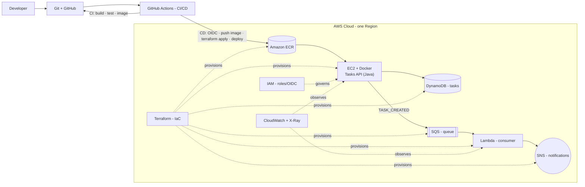

# Architecture

This is the system the repository builds, end to end. It mirrors the course
architecture diagram.

## End-to-end flow

A developer pushes code → GitHub Actions builds and tests it (**CI**) → on merge
to `main`, the pipeline authenticates to AWS with **OIDC**, pushes the image to
**ECR**, runs **`terraform apply`**, deploys the new image to **EC2**, and
smoke-tests it (**CD**). At runtime the Tasks API runs as a container on EC2,
stores tasks in **DynamoDB**, and on each new task publishes a message to
**SQS**; a **Lambda** consumes the queue and publishes a notification to **SNS**.
**IAM** governs all permissions, **Terraform** provisions every resource, and
**CloudWatch + X-Ray** observe everything.

## Components

| Component | What it is | Where in the repo |
|---|---|---|
| **Tasks API** | Plain-Java HTTP service (`com.sun.net.httpserver`, no framework). CRUD over tasks. | `app/` |
| **Lambda consumer** | Java function triggered by SQS; publishes an SNS notification per task. | `lambda/` |
| **Docker image** | Multi-stage build → small non-root JRE image; runs on EC2. | `docker/Dockerfile` |
| **DynamoDB** | Key-value store for tasks (partition key `id`, on-demand billing). | `infra/dynamodb.tf` |
| **SQS + DLQ** | `task-events` queue carries `TASK_CREATED`; failures go to a dead-letter queue. | `infra/messaging.tf` |
| **SNS** | `task-notifications` topic; optional email subscription. | `infra/messaging.tf` |
| **ECR** | Private image registry with scan-on-push and a lifecycle policy. | `infra/ecr.tf` |
| **EC2** | Free-tier instance; user-data runs the container as a systemd service, pulling the tag from SSM. Shell access via SSM (no SSH). | `infra/ec2.tf` |
| **IAM + OIDC** | GitHub OIDC provider + a scoped deploy role; least-privilege instance and Lambda roles. | `infra/iam.tf`, `infra/lambda.tf` |
| **CI** | Build + test on every push/PR; build the image. | `.github/workflows/ci.yml` |
| **CD** | OIDC → push image → `terraform apply` → SSM deploy → smoke; `production` approval. | `.github/workflows/cd.yml` |
| **Observability** | EMF metrics, CloudWatch logs + alarm, X-Ray traces via the ADOT agent. | `infra/observability.tf`, `app/.../util/Metrics.java` |
| **State backend** | S3 (versioned, encrypted, TLS-only) + DynamoDB lock. | `infra/bootstrap/` |

## Local mirror (LocalStack)

For development with no AWS account, `docker compose` runs the app plus
**LocalStack**, which emulates DynamoDB, SQS, SNS and Lambda. An init script
creates the same table/queues/topic (in the same region) and deploys the Lambda,
so the full `POST → SQS → Lambda → SNS` chain runs on a laptop. See the
[README](../README.md) quickstart.

## Request & event paths

- **Create:** `POST /tasks` → validate → write to DynamoDB → publish
  `TASK_CREATED` to SQS (best-effort; never fails the request) → `201` with the
  task and a `Location` header.
- **Event:** SQS → Lambda (batch, partial-batch failures) → parse → publish an
  SNS notification → idempotent on `taskId`.
- **Observe:** every request emits one EMF log line (a CloudWatch metric for
  latency + the `TasksCreated` count); a 5xx or a Lambda error trips a CloudWatch
  alarm that notifies SNS; the ADOT agent + Lambda active tracing produce an
  X-Ray trace spanning API → SQS → Lambda.
