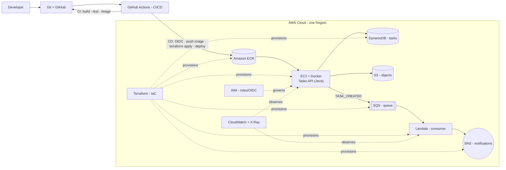

# PRD — "Tasks API" Course Reference Implementation

**Document type:** Product Requirements Document (build spec)
**Primary consumer:** an AI coding agent that will build the entire repository
**End users:** students of an 8-session Cloud/DevOps course (beginners, ~3 months of Java)
**Version:** 1.0
**Related docs:** `syllabus.html` (course plan + architecture diagram)

> **How to use this document (for the coding agent):** Build a single Git repository that implements the system described here, end to end — application code, tests, Docker, CI, CD, Terraform IaC, event processing, and observability. Work in the milestone order in §20, commit incrementally, and tag each session state (§19). Everything in the architecture (§6) must exist and actually work. Prefer clarity and comments over cleverness — students read this code.

---

## 1. Purpose & context

Build a complete, working reference implementation of the **Tasks API** that backs a hands-on course. Students clone the repo and follow it from plain Java code all the way to a fully deployed, automated, observable cloud system on AWS. The repository must demonstrate, end to end and in a beginner-readable way:

1. Writing the application (plain Java).
2. Building & testing automatically (CI, GitHub Actions).
3. Packaging it (Docker).
4. Deploying it to AWS (EC2 + Lambda).
5. Adding data & events (DynamoDB, S3, SQS, SNS).
6. Defining infrastructure as code (Terraform) and an image registry (ECR).
7. Automating deployment (CD with GitHub OIDC).
8. Observing it (CloudWatch logs/metrics/alarms, X-Ray traces).

## 2. Audience & implications

- **The code is teaching material.** It must be simple, idiomatic, and **heavily commented** (explain *why*, not just *what*). No web framework. No clever abstractions beyond what the course teaches.
- **It must run locally with one command** (no AWS account required for local dev — use LocalStack).
- **It must be cost-safe** in the cloud (AWS Free Plan friendly, fully destroyable).

## 3. Goals

| ID | Goal |
|----|------|
| G1 | A working HTTP API in **plain Java 17** using the built-in `com.sun.net.httpserver.HttpServer` (no Spring / web framework). |
| G2 | Persistence via **DynamoDB**, with local parity through **LocalStack**. |
| G3 | Event-driven async flow: **POST → SQS → Lambda → SNS**. |
| G4 | **Docker** multi-stage image; local stack via **docker-compose**. |
| G5 | **CI** (GitHub Actions): build, unit + integration tests, image build on every push/PR. |
| G6 | **CD** (GitHub Actions): OIDC auth, push to ECR, `terraform apply`, deploy to EC2, smoke test, with a manual approval environment. |
| G7 | **Terraform** provisions **all** AWS resources (nothing created by hand). |
| G8 | **Observability**: structured logs → CloudWatch, a custom metric + alarm, distributed traces → X-Ray spanning API→SQS→Lambda. |
| G9 | **Teaching-friendly**: per-session Git tags, a great README, and a `SESSIONS.md` mapping. |
| G10 | **Cost-safe**: free-tier sizing, `terraform destroy` tears everything down. |

## 4. Non-goals

- No production hardening beyond course scope (no multi-AZ HA, autoscaling groups, custom domain, or TLS termination — HTTP on a port is fine).
- No frontend UI (API only).
- No Kubernetes / ECS as the primary path (EC2 + Docker is the deploy target; ECS Fargate may be mentioned in docs as an alternative but is **out of scope** to implement).
- No relational database (DynamoDB only; RDS stays conceptual).

## 5. Tech stack & constraints

- **Language/build:** Java 17 (LTS), **Maven** (multi-module: `app`, `lambda`).
- **HTTP layer:** `com.sun.net.httpserver.HttpServer` only. **No Spring/Quarkus/Micronaut/Javalin.**
- **Allowed libraries** (these are libraries, not frameworks): AWS SDK for Java **v2**, **Jackson** (JSON), **JUnit 5**, OpenTelemetry / **AWS Distro for OpenTelemetry (ADOT)** Java agent. Keep dependencies minimal and pinned.
- **Containers:** Docker (multi-stage), docker-compose for local.
- **Local AWS:** LocalStack (DynamoDB, SQS, SNS, S3, Lambda).
- **IaC:** Terraform `>= 1.6`, AWS provider `~> 5.x`. Remote state (S3 + DynamoDB lock).
- **CI/CD:** GitHub Actions; AWS auth via **OIDC** (no long-lived access keys anywhere).
- **AWS region:** configurable via variable; default `eu-central-1` (note in README: choose the region closest to students). Free-Plan conscious.
- **Determinism:** pin tool versions; `terraform plan` must be clean after `apply`.

## 6. High-level architecture

The repo must implement exactly this system (mirrors the course architecture diagram):



**End-to-end flow:** Developer pushes code → GitHub Actions builds & tests (CI) → on merge to `main`, the pipeline authenticates to AWS with OIDC, pushes the image to ECR, runs `terraform apply`, deploys the new image to EC2, and smoke-tests it (CD). At runtime the Tasks API runs as a container on EC2, stores tasks in DynamoDB, and on each new task publishes a message to SQS; a Lambda consumes the queue and publishes a notification to SNS. IAM governs all permissions, Terraform provisions every resource, and CloudWatch + X-Ray observe everything.

## 7. Repository structure

```
tasks-api/
├── README.md                  # what it is, quickstart, deploy, env vars, cost, troubleshooting
├── SESSIONS.md                # maps Git tags/files to the 8 course sessions
├── LICENSE
├── .gitignore                 # ignores tfstate, *.tfvars (except examples), target/, .env, keys
├── Makefile                   # convenience: run, test, build, compose-up, tf-*, destroy, smoke
├── docs/
│   ├── architecture.md        # the diagram + explanation (mirror §6)
│   └── runbook.md             # deploy / rollback / common incidents
├── app/                       # the Tasks API service
│   ├── pom.xml
│   └── src/
│       ├── main/java/com/course/tasksapi/
│       │   ├── App.java               # HttpServer bootstrap + routing
│       │   ├── handlers/              # HealthHandler, TasksHandler
│       │   ├── model/Task.java
│       │   ├── repo/TaskRepository.java, InMemoryTaskRepository.java, DynamoDbTaskRepository.java
│       │   ├── events/EventPublisher.java, NoOpEventPublisher.java, SqsEventPublisher.java
│       │   ├── config/Config.java     # reads env vars
│       │   └── util/Json.java, Logging.java
│       └── test/java/com/course/tasksapi/   # unit + integration tests
├── lambda/                    # SQS consumer Lambda (Java)
│   ├── pom.xml
│   └── src/main/java/com/course/tasksevents/Handler.java
├── docker/
│   ├── Dockerfile             # multi-stage
│   ├── .dockerignore
│   └── docker-compose.yml     # app + localstack (+ x-ray/adot collector for local traces)
├── localstack/
│   └── init/01-create-resources.sh   # creates table/queue/topic in LocalStack on startup
├── infra/                     # Terraform (root module)
│   ├── backend.tf  providers.tf  variables.tf  outputs.tf
│   ├── network.tf  ecr.tf  ec2.tf  dynamodb.tf  messaging.tf  lambda.tf
│   ├── iam.tf      observability.tf
│   ├── terraform.tfvars.example
│   └── bootstrap/             # one-time: creates S3 state bucket + Dynamo lock table
├── scripts/
│   ├── local-seed.sh          # create a couple of tasks locally
│   └── smoke-test.sh          # curl /health + create/get a task against a base URL
└── .github/workflows/
    ├── ci.yml
    └── cd.yml
```

---

## 8. Application requirements (functional)

### 8.1 Endpoints

| Method | Path | Request body | Success | Errors |
|--------|------|--------------|---------|--------|
| `GET` | `/health` | — | `200` `{"status":"UP","version":"<v>"}` | — |
| `GET` | `/tasks` | — | `200` `{"tasks":[Task...],"count":N}` | `500` |
| `POST` | `/tasks` | `{"title":"...","description":"...?"}` | `201` `Task` + `Location` header | `400` invalid, `500` |
| `GET` | `/tasks/{id}` | — | `200` `Task` | `404` not found |
| `PUT` | `/tasks/{id}` *(SHOULD)* | `{"done":true}` or `{"title","description","done"}` | `200` `Task` | `400`, `404` |
| `DELETE` | `/tasks/{id}` *(SHOULD)* | — | `204` | `404` |

- `GET`/`POST`/`GET{id}` are **MUST**. `PUT`/`DELETE` are **SHOULD** (implement if time allows; they round out the model and CRUD demos).
- Unknown routes → `404`; unsupported method on a known path → `405`.

### 8.2 Data model — `Task`

```json
{
  "id": "uuid-v4",
  "title": "string (required, 1..200 chars)",
  "description": "string (optional, <= 2000 chars)",
  "done": false,
  "createdAt": "ISO-8601 UTC, e.g. 2026-06-14T12:00:00Z"
}
```

- `id` is server-generated (UUID). `createdAt` server-generated. `done` defaults to `false`.

### 8.3 Behavior & rules

- **FR-1** Content type `application/json` for request and response bodies; reject non-JSON `POST`/`PUT` with `415` or `400`.
- **FR-2** Validation: `title` required and non-blank, length ≤ 200; `description` ≤ 2000. On failure return `400` with body `{"error":"VALIDATION","message":"..."}`.
- **FR-3** Consistent error shape everywhere: `{"error":"<CODE>","message":"<human readable>"}`.
- **FR-4** Each request logs one **structured JSON** line: `{ts, level, requestId, method, path, status, durationMs}` (see §15).
- **FR-5** A unique `requestId` (UUID) is generated per request and returned in an `X-Request-Id` response header.
- **FR-6 (storage abstraction)** A `TaskRepository` interface with two implementations selected by env var `STORAGE`:
  - `memory` → `InMemoryTaskRepository` (default; used in session 1 and unit tests).
  - `dynamodb` → `DynamoDbTaskRepository` (sessions 5+; uses AWS SDK v2; honors `AWS_ENDPOINT_URL` so it works against LocalStack).
- **FR-7 (eventing abstraction)** An `EventPublisher` interface with:
  - `NoOpEventPublisher` (default when no queue configured),
  - `SqsEventPublisher` (used when `TASK_EVENTS_QUEUE_URL` is set). On successful `POST /tasks`, publish a `TASK_CREATED` event (§9). Publishing failure must **not** fail the request (log a warning).
- **FR-8** The server uses a bounded thread pool (`HttpServer` with an `Executor`), binds to `APP_PORT` (default `8080`), and shuts down gracefully on `SIGTERM`.
- **FR-9** Config is read **only** from environment variables (§10). No secrets or endpoints hard-coded.

### 8.4 Acceptance criteria (app)

- `GET /health` returns `200 {"status":"UP",...}`.
- `POST /tasks` with `{"title":"Learn Docker"}` returns `201` with a generated `id`, `done:false`, `createdAt`; `GET /tasks/{id}` then returns it; `GET /tasks` includes it with correct `count`.
- `POST /tasks` with empty/missing `title` returns `400` and the standard error shape.
- With `STORAGE=dynamodb` and LocalStack running, the same scenarios pass and the item is visible in the DynamoDB table.
- With `TASK_EVENTS_QUEUE_URL` set, a `POST` puts exactly one `TASK_CREATED` message on the queue.

---

## 9. Eventing

- **SQS message** (body, JSON):
  ```json
  { "type": "TASK_CREATED", "taskId": "<uuid>", "title": "<title>", "occurredAt": "<ISO-8601>" }
  ```
- **Lambda consumer** (`lambda/` module): triggered by an SQS **event source mapping** (batch). For each record it:
  1. Parses the message and logs a structured line (with `taskId`).
  2. Publishes a notification to the **SNS** topic: subject `Task created`, message human-readable incl. `taskId`/`title`.
  3. Is **idempotent** (safe to process the same `taskId` twice — no duplicate side effects beyond a log).
  - On parse error, do not throw for the whole batch; use partial batch response / send bad records to the DLQ.
- **SNS topic:** if variable `notification_email` is set, create an email subscription to it (student confirms via email).
- **Acceptance:** creating a task results in (a) an SQS message, (b) a Lambda invocation visible in its CloudWatch logs, (c) an SNS publish. Locally this is exercised through LocalStack; in AWS it is real.

---

## 10. Configuration (environment variables)

| Var | Default | Purpose |
|-----|---------|---------|
| `APP_PORT` | `8080` | Port the HTTP server binds to |
| `APP_VERSION` | `dev` | Returned by `/health`; set to git sha in CI/CD |
| `STORAGE` | `memory` | `memory` or `dynamodb` |
| `AWS_REGION` | — | AWS region (e.g. `eu-central-1`) |
| `AWS_ENDPOINT_URL` | *(unset)* | If set, AWS SDK targets this (LocalStack `http://localstack:4566`) |
| `TASKS_TABLE` | `tasks` | DynamoDB table name |
| `TASK_EVENTS_QUEUE_URL` | *(unset)* | If set, enables `SqsEventPublisher` |
| `NOTIFICATIONS_TOPIC_ARN` | *(unset)* | SNS topic the Lambda publishes to |
| `LOG_LEVEL` | `INFO` | Logging level |
| `OTEL_*` | — | OpenTelemetry/ADOT agent config for tracing (see §15) |

README must show the **local** value set (compose) and the **cloud** value set (Terraform-provided).

---

## 11. Local development (no AWS account needed)

- **FR-LD-1** `docker compose -f docker/docker-compose.yml up` starts: the **app**, **localstack**, and (optionally) an **ADOT/X-Ray collector** for local traces.
- **FR-LD-2** `localstack/init/01-create-resources.sh` runs on LocalStack startup and creates the DynamoDB table, SQS queue (+ DLQ), and SNS topic, and (optionally) deploys the Lambda + event source mapping to LocalStack.
- **FR-LD-3** In compose, the app runs with `STORAGE=dynamodb`, `AWS_ENDPOINT_URL=http://localstack:4566`, and the queue/topic env vars wired to the LocalStack resources.
- **FR-LD-4** `make run` runs the app directly (memory mode) for the session-1 experience; `make compose-up` runs the full local stack.
- **Acceptance:** with only Docker installed, a student runs one command and can `curl` the full flow locally, including a task creation triggering the Lambda via LocalStack.

---

## 12. Containerization

- **FR-DK-1** Multi-stage `Dockerfile`:
  - **build stage:** `maven:3.9-eclipse-temurin-17` → `mvn -q -pl app -am package` producing a runnable JAR.
  - **runtime stage:** `eclipse-temurin:17-jre` (or distroless Java 17) running the JAR.
- **FR-DK-2** Runs as a **non-root** user; `EXPOSE 8080`; `HEALTHCHECK` curling `/health`.
- **FR-DK-3** `.dockerignore` excludes `target/`, `.git`, tests artifacts, `infra/`, etc.
- **FR-DK-4** Image labeled with version/commit; target size < ~250 MB.
- **Acceptance:** `docker build` succeeds; `docker run -p 8080:8080 ` serves `/health`; image is non-root.

---

## 13. Infrastructure as Code (Terraform) — all resources

> Everything below is created by Terraform. Nothing is created by clicking in the console.

### 13.1 State backend (`infra/bootstrap/`)
- One-time bootstrap creates an **S3 bucket** (versioned, encrypted) for state and a **DynamoDB table** for state locking. `infra/backend.tf` then configures the S3 backend. README documents the bootstrap step.

### 13.2 Networking (`network.tf`)
- Use the **default VPC + default subnets** (data sources) to stay simple and free.
- A **security group** for the app: inbound `APP_PORT` (8080) from a configurable CIDR (`allowed_cidr`, default `0.0.0.0/0` with a warning to restrict), egress all. No SSH ingress required (use SSM).

### 13.3 ECR (`ecr.tf`)
- Private **ECR repository** with image scanning on push and a lifecycle policy that expires untagged/old images.

### 13.4 IAM + OIDC (`iam.tf`)
- **GitHub OIDC provider** (`token.actions.githubusercontent.com`).
- **Deploy role** (assumed by GitHub Actions via OIDC) with a trust policy scoped to the repo (`repo:<ORG>/<REPO>:ref:refs/heads/main` and the `production` environment). Least-privilege permissions: ECR push, read Terraform state (S3+lock), SSM `SendCommand` to the instance, read Terraform outputs, pass the instance role where required.
- **EC2 instance role/profile:** ECR pull, DynamoDB CRUD on the table, SQS `SendMessage` to the queue, CloudWatch Logs, X-Ray `PutTraceSegments`, and `AmazonSSMManagedInstanceCore`.
- **Lambda execution role:** SQS receive/delete on the queue (+ DLQ), SNS publish on the topic, CloudWatch Logs, X-Ray.

### 13.5 Compute (`ec2.tf`)
- **EC2 instance**, free-tier type (`t3.micro`/`t2.micro` via variable), latest **Amazon Linux 2023** AMI (resolved via SSM public parameter), the instance profile from §13.4, and **user-data** that: installs Docker + SSM agent + CloudWatch agent, logs in to ECR, and runs the app image as a **systemd service** (auto-restart), reading the image tag from an SSM Parameter (so CD can update it). App logs go to CloudWatch via the `awslogs` Docker log driver or the CW agent.

### 13.6 Data (`dynamodb.tf`)
- **DynamoDB table** `tasks`: partition key `id` (S), **on-demand** billing (cost-safe). PITR off (cost).
- *(S3 bucket for "objects" is optional/demo: create a private bucket the app can write to, used to show S3 in the architecture.)*

### 13.7 Messaging (`messaging.tf`)
- **SQS** main queue + **DLQ** (redrive after N receives).
- **SNS** topic (+ optional email subscription from `notification_email`).

### 13.8 Lambda (`lambda.tf`)
- **Lambda function** from the `lambda/` build artifact (Java 17 runtime), env wired to the SNS topic ARN, X-Ray active tracing enabled.
- **Event source mapping** SQS → Lambda (batch size, partial-batch responses).

### 13.9 Observability (`observability.tf`)
- **CloudWatch log groups** for app and Lambda (retention e.g. 14 days).
- A **custom metric** path (the app emits `TasksCreated` and request latency — via EMF or `PutMetricData`).
- A **CloudWatch alarm**: triggers on app `5xx` count > 0 over 5 min (or Lambda `Errors` > 0); alarm action → the SNS topic.
- **X-Ray** enabled for app (via ADOT collector) and Lambda.

### 13.10 Variables & outputs
- **Variables:** `project_name`, `environment`, `aws_region`, `github_repo` (`org/repo`), `instance_type`, `allowed_cidr`, `notification_email`, `image_tag`.
- **Outputs:** `ecr_repository_url`, `api_base_url` (EC2 public DNS + port), `instance_id`, `tasks_table_name`, `queue_url`, `topic_arn`, `deploy_role_arn`.
- **Acceptance:** from a clean account, `bootstrap` then `terraform apply` creates the full system; outputs are correct; `terraform plan` is clean afterwards; `terraform destroy` removes everything.

---

## 14. CI/CD (GitHub Actions)

### 14.1 CI — `.github/workflows/ci.yml`
- **Triggers:** `push` (all branches) and `pull_request` → `main`.
- **Jobs:**
  - `build-test`: checkout → setup-java 17 (cache Maven) → `mvn -B verify` (unit tests **and** integration tests against a LocalStack **service container**) → upload test reports.
  - `docker-build`: build the image (no push) to prove the Dockerfile works.
- **Required** as a status check for merging to `main` (documented; branch protection set by the instructor).

### 14.2 CD — `.github/workflows/cd.yml`
- **Triggers:** `push` → `main` (and `workflow_dispatch`).
- **Permissions:** `id-token: write`, `contents: read` (OIDC).
- **Environment:** `production` with a **required reviewer** (manual approval) before deploy.
- **Steps:**
  1. `aws-actions/configure-aws-credentials` via **OIDC** assuming the deploy role (no static keys).
  2. Login to ECR; build & push image tagged with the **git SHA** and `latest`.
  3. `terraform init` (S3 backend) → `apply` passing `image_tag=<sha>`.
  4. **Deploy:** update the SSM Parameter to the new tag and send an **SSM RunCommand** to the instance to pull the tag and restart the systemd service. *(No SSH keys in CI.)*
  5. **Smoke test:** `scripts/smoke-test.sh <api_base_url>` (poll `/health`, then create + read a task); fail the job if it doesn't pass.
- **Secrets/variables:** repository **variables** for `AWS_REGION`, `AWS_DEPLOY_ROLE_ARN`, `ECR_REPOSITORY`, etc. **No** `AWS_ACCESS_KEY_ID`/`SECRET` anywhere.
- **Acceptance:** opening a PR runs CI; merging to `main` (after approval) builds, pushes, applies, deploys, and smoke-tests; the running app serves the new version (`/health` shows the new `APP_VERSION`).

---

## 15. Observability

- **Logs:** structured **JSON** to stdout (one line per request, §8.3 FR-4) → CloudWatch Logs. Provide a tiny logging helper (or `java.util.logging` with a JSON formatter) — no heavy logging framework. Logs must be queryable with **CloudWatch Logs Insights**.
- **Metrics:** emit a custom metric `TasksCreated` (count) and request latency (ms), preferably via **EMF (Embedded Metric Format)** so logs double as metrics; otherwise `PutMetricData`.
- **Alarm:** the CloudWatch alarm from §13.9 (5xx/Lambda errors) notifies via SNS.
- **Traces:** attach the **ADOT/OpenTelemetry Java agent** with `-javaagent` (zero app code changes) to auto-instrument the HTTP server and AWS SDK calls; export to **AWS X-Ray** (via an ADOT collector running alongside the app on EC2, and native active tracing for the Lambda). A single trace must show the path **API → SQS → Lambda**.
- **Acceptance:** logs visible & queryable; the custom metric and alarm exist; inducing a `5xx` fires the alarm; a created task produces a connected X-Ray trace across API→SQS→Lambda.

---

## 16. Testing

- **Unit tests (JUnit 5):** handlers, validation, JSON (de)serialization, `InMemoryTaskRepository`.
- **Integration tests:** against LocalStack (DynamoDB + SQS) using **Testcontainers LocalStack** (or the CI LocalStack service container). Cover: persist+read via `DynamoDbTaskRepository`, and `SqsEventPublisher` enqueues a message.
- **Smoke test:** `scripts/smoke-test.sh` used by CD.
- **Coverage:** core domain ≥ ~70%.
- **Acceptance:** `mvn verify` is green locally and in CI.

---

## 17. Security & cost

- **Auth:** GitHub→AWS via **OIDC** only; **no** long-lived keys in the repo or CI.
- **IAM:** least privilege for deploy role, instance role, and Lambda role (scope to specific ARNs).
- **Secrets:** none committed. `.gitignore` covers `*.tfstate*`, `*.tfvars` (except `*.example`), `.env`, `*.pem`.
- **Network:** security group exposes only the app port; default to a documented `allowed_cidr` and warn to restrict.
- **Cost:** `t3.micro`, on-demand DynamoDB, short log retention; **`make destroy`** (= `terraform destroy`) tears it all down. README documents AWS **Free Plan** ($200 credit / 6 months) and a Budgets reminder.

---

## 18. Documentation (must ship in the repo)

- **README.md:** overview; the architecture diagram (mermaid §6); prerequisites; **local quickstart** (one command); **deploy guide** (bootstrap state, set variables, create the GitHub OIDC role, configure repo variables, push to `main`); env-var table; **cost & cleanup**; troubleshooting.
- **docs/architecture.md:** the diagram + a component-by-component explanation.
- **docs/runbook.md:** how to deploy, roll back (re-point image tag / `terraform apply` previous), and handle common incidents (alarm fired, deploy failed, smoke test red).

---

## 19. Teaching progression — Git tags (one per session)

Commit incrementally and create an annotated tag at each session's end state so students can `git checkout` the repo as it looked at that point. `SESSIONS.md` lists each tag, what it contains, and which files were added.

| Tag | Session | Repo state |
|-----|---------|-----------|
| `v1-code` | 1 · Code | `app/` (memory storage), unit tests, `make run`, README quickstart |
| `v2-ci` | 2 · Build & Test | `.github/workflows/ci.yml` (build + test) |
| `v3-docker` | 3 · Package | `docker/Dockerfile`, `.dockerignore`, `docker-compose.yml`; CI also builds image |
| `v4-aws-compute` | 4 · Deploy I | `infra/` core (network, ecr, iam+OIDC, ec2), manual deploy documented; first Lambda stub |
| `v5-data-events` | 5 · Deploy II | DynamoDB repo, SQS/SNS, Lambda consumer, LocalStack integration + integration tests |
| `v6-iac-ecr` | 6 · Deploy III | multi-stage image to **ECR**, full Terraform incl. provisioning the container on EC2 |
| `v7-cd` | 7 · Deploy IV | `.github/workflows/cd.yml` (OIDC → push → apply → deploy → smoke), `production` env |
| `v8-observability` | 8 · Observe | structured logs, custom metric, alarm, X-Ray tracing across API→SQS→Lambda |
| `main` | — | final complete system |

---

## 20. Build order (milestones for the agent)

1. **M1** — `app/` (HttpServer, routing, model, in-memory repo, JSON, logging) + unit tests + `make run`. Tag `v1-code`.
2. **M2** — `ci.yml` (build + test). Tag `v2-ci`.
3. **M3** — `Dockerfile` (multi-stage) + `docker-compose.yml` + LocalStack init; CI builds image. Tag `v3-docker`.
4. **M4** — Terraform core (backend bootstrap, network, ECR, IAM+OIDC, EC2 + user-data), manual deploy documented. Tag `v4-aws-compute`.
5. **M5** — DynamoDB repo + SQS publisher + Lambda consumer + SNS + LocalStack integration tests. Tag `v5-data-events`.
6. **M6** — Push image to ECR; Terraform runs the container on EC2 from ECR. Tag `v6-iac-ecr`.
7. **M7** — `cd.yml` OIDC pipeline (push → apply → deploy → smoke) + `production` approval. Tag `v7-cd`.
8. **M8** — Observability (logs, metric, alarm, X-Ray) + docs polish + `SESSIONS.md`. Tag `v8-observability`, finalize `main`.

---

## 21. Definition of Done (checklist)

- [ ] `app/` runs locally in memory mode (`make run`) and serves all MUST endpoints with correct status codes.
- [ ] `mvn verify` passes unit **and** LocalStack integration tests.
- [ ] `docker compose up` runs app + LocalStack; full flow (incl. SQS→Lambda→SNS) works locally.
- [ ] Multi-stage image builds, runs non-root, healthchecks.
- [ ] `infra/` bootstraps state and `terraform apply` provisions **every** resource in §13; `plan` clean afterwards; `destroy` is clean.
- [ ] CI runs on PRs (build + test + image). CD on `main` deploys via **OIDC** (no static keys), pushes to ECR, applies Terraform, deploys to EC2, smoke test passes; `production` requires approval.
- [ ] CloudWatch shows app + Lambda logs; custom metric + alarm exist; alarm fires on induced 5xx; one X-Ray trace spans API→SQS→Lambda.
- [ ] Creating a task: persists to DynamoDB, emits SQS message, invokes Lambda, publishes SNS.
- [ ] Per-session tags `v1-code`…`v8-observability` exist; `SESSIONS.md` and `README.md` complete; code is commented for beginners.
- [ ] No secrets committed; `.gitignore` correct; least-privilege IAM.

## 22. End-to-end acceptance scenarios

1. **Local:** `docker compose up` → `curl /health` `200` → `POST /tasks` `201` → `GET /tasks/{id}` `200` → LocalStack shows item, SQS message consumed by Lambda, SNS publish logged.
2. **Cloud deploy:** push to `main` → approve `production` → pipeline green → `curl <api_base_url>/health` shows new `APP_VERSION`.
3. **Cloud event flow:** `POST /tasks` on the deployed API → item in DynamoDB → Lambda logs the event → SNS notification (email if configured) → X-Ray trace connects API→SQS→Lambda.
4. **Resilience/obs:** force a `5xx` (test route or bad input path) → CloudWatch alarm fires → SNS notifies.
5. **Cleanup:** `make destroy` removes all resources; re-`apply` recreates them.

---

## Appendix A — anchoring snippets (illustrative, not exhaustive)

**A.1 `App.java` (shape)**
```java
public class App {
  public static void main(String[] args) throws IOException {
    Config cfg = Config.fromEnv();
    TaskRepository repo = Repositories.create(cfg);      // memory | dynamodb
    EventPublisher events = Publishers.create(cfg);      // noop | sqs
    HttpServer server = HttpServer.create(new InetSocketAddress(cfg.port()), 0);
    server.setExecutor(Executors.newFixedThreadPool(16));
    server.createContext("/health", new HealthHandler(cfg));
    server.createContext("/tasks",  new TasksHandler(repo, events)); // routes /tasks and /tasks/{id}
    Runtime.getRuntime().addShutdownHook(new Thread(() -> server.stop(2)));
    server.start();
  }
}
```

**A.2 Dockerfile (multi-stage, shape)**
```dockerfile
FROM maven:3.9-eclipse-temurin-17 AS build
WORKDIR /src
COPY . .
RUN mvn -q -pl app -am -DskipTests package

FROM eclipse-temurin:17-jre
RUN useradd -r -u 10001 appuser
WORKDIR /app
COPY --from=build /src/app/target/*-shaded.jar app.jar
# OTEL agent copied in for tracing (session 8)
EXPOSE 8080
USER appuser
HEALTHCHECK CMD wget -qO- http://localhost:8080/health || exit 1
ENTRYPOINT ["java","-jar","/app/app.jar"]
```

**A.3 CD OIDC auth (shape)**
```yaml
permissions: { id-token: write, contents: read }
steps:
  - uses: actions/checkout@v4
  - uses: aws-actions/configure-aws-credentials@v4
    with:
      role-to-assume: ${{ vars.AWS_DEPLOY_ROLE_ARN }}
      aws-region: ${{ vars.AWS_REGION }}
  - uses: aws-actions/amazon-ecr-login@v2
  # build & push image, terraform apply, SSM deploy, smoke test ...
```

**A.4 Terraform — GitHub OIDC deploy role (shape)**
```hcl
data "aws_iam_openid_connect_provider" "github" { url = "https://token.actions.githubusercontent.com" }
# trust: aud = sts.amazonaws.com ; sub = "repo:<ORG>/<REPO>:ref:refs/heads/main"
# attach least-privilege policy: ECR push, SSM SendCommand, S3/Dynamo state, read outputs
```

**A.5 Sample requests**
```bash
curl -s http://localhost:8080/health
# {"status":"UP","version":"dev"}

curl -s -X POST http://localhost:8080/tasks \
  -H 'Content-Type: application/json' \
  -d '{"title":"Learn Docker"}'
# 201 {"id":"...","title":"Learn Docker","done":false,"createdAt":"..."}
```

---

*Build it so a beginner can clone the repo, run it locally in one command, read the comments to understand each piece, and watch a `git push` flow all the way to a live, observable service on AWS.*
